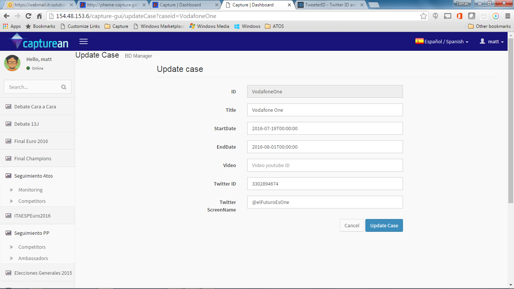

# CAPTUREAN – Configuración de canales y visualización en el dashboard nines

Data Channels (DC) y Data Pools (DP) son ambos objetos de datos manejados por Capturean. Un DC es el objeto principal que lleva asociadas búsquedas para extraer datos de las redes sociales. En concreto, un DC se programa para extraer datos de Twitter a través de las APIs programables disponibles. Al DC se le asocian los criterios de búsqueda (hashtags, keywords, etc.), utilizando expresiones lógicas con toda la expresividad que permiten las APIS de Search o de Streaming de Twitter. El resultado es que un DC permite recuperar de Twitter tuits que cumplan las condiciones de las citadas búsquedas. Por ejemplo, un DC con una búsqueda asociada (también conocida como Data Source o DS) por el hashtag “#Eurocopa2016”, recuperará todos los tuits que contengan dicho hashtag (respetando los amplios límites que propone Twitter en sus Términos y Condiciones”).

El DP permite filtrar sobre el contenido de un DC. Es decir, un DP no accede de nuevo a la fuente (Twitter), sino que es una vista parcial del contenido de un determinado DC.  Así, en el ejemplo anterior, un DP asociado al DC que captura datos para el hashtag #Eurocopa2016, podría especializarse para filtrar tuits que nombren a un determinado jugador, por ejemplo “Casillas”. El DP es por tanto una vista parcial de un DC, que contiene tuirs filtrados del primero sin necesidad de volver a Twitter para capturarlos.

Desde el punto de vista de Capturean, un DC y un DP son los objetos de datos primordiales, intercambiables a la hora de formar parte de posteriores análisis o visualizaciones.
Una vez creado un DC y/o un DP, los datos fluyen en Capturean y podrían usarse los servicios REST proporcionados para ello para acceder a los datos. Sin embargo, si se requiere su visualización en el Dashboard de Capturean, DC y DP se pueden asociar a opciones de visualización de una manera configurable.

Para configurar las opciones de menú de la aplicación hay que realizar una serie de pasos, como crear los casos oportunos (opciones de menú que permiten visualizar uno o más canales), las opciones de visualización de los canales (look & feel), así como otros parámetros que permitirán mostrar los datos en una página con layouts predeterminados para los distintos usos de la aplicación (Monitorización de marca,  seguimiento de eventos o debates, monitorización simple, etc.).
La figura siguiente muestra de forma esquemática los pasos de configuración de las opciones de menú:

Desde las opciones de menú de un usuario que sea Administrador de Datos

1.	Crear canales: Data Channel y filtrados por Data Pool
	- Data Channel: http://154.48.153.6/capture-gui/newDataChannel El DC es el responsable de la captura de datos de Twitter. Puede ser de tipo “search” o “stream”.
		- Un usuario puede ejecutar búsquedas en Twitter sobre múltiples DC de tipo search simultáneos, pero sólo sobre uno de tipo stream (limitaciones del API de Twitter). 
		- Los DC de tipo stream proporcionan inmediatez (las modificaciones se incorporan en caliente y las búsquedas reflejan los resultados de dichos cambios). Por tanto se suelen usar para seguir eventos cortos que requieren de detalle y rápidez. Por defecto para los DC de tipo stream se calculan agregaciones por minuto. Debido a sus características, se suelen asignar a casos con páginas de tipo “evento”.
		- Los DC de tipo search tienen una mayor riqueza expresiva en sus queries. Por defecto para los DC de tipo search se calculan agregaciones por hora y día. Los DC de tipo search pueden llegar a recuperar datos de en torno a una semana de antigüedad, si se prepara para ello, aunque también puede simular un stream y devolver los datos ordenados (según se generaron los tuits), o desordenados (en el orden que proporciona el API de Twitter, generalmente inverso a su creación). Esto no es muy relevante en la mayor parte de los casos, excepto que se quiera simular un stream. La ordenación conlleva un cierto retraso en la recepción de los tuits ya que se generar micro-batches para proceder a su ordenación. 
		- Los DC estarán activos entre las fechas de inicio y fin de captura, y recuperarán datos para el conjunto de todas las queries expresadas en los Data Sources asociados al DC. Las queries asociadas a cada DS tienen exactamente la misma semántica que las APIs de Twitter de Search y Streaming (para DC de tipo search o stream, respectivamente).
		- Descripcion de campos
	- Data Pool: http://154.48.153.6/capture-gui/newDataPool En caso de querer filtrar más el contenido del DC, se pueden poner opciones de filtrado creando un Data Pool.  Se hace de manera similar al DC. Por ejemplo, sobre un mismo DC se pueden crear varios DP que filtren por idioma o por determinadas keywords. Los DP son por tanto vistas filtradas sobre los DC.

2.	Asociar aspecto: Crear opción de visualización
	- http://154.48.153.6/capture-gui/addDcdp 
	- Ahí se da de alta las opciones de visualización con los siguientes campos:
		- ID: El ID del DC o del DP creado anteriormente
		- Title: El título o nombre del DC
		- Description: La descripción del DC
		- Color: El color con el que aparecerá en las gráficas
		- Avatar: El avatar con el que aparecerá en las gráficas. De momento no está automatizado para subir el fichero desde la GUI. Hay que meterlo directamente en una carpeta del servidor y actualizar el dato a mano. 
			- NOTA: Esto en el futuro será automatizado, pero ahora requiere el concurso de un administrador. Mejora programada.
		- ComparatorGroup:  Campo que permite crear varias vistas por idioma y grupo. Por defecto, se puede poner “es” si es el idioma español, pero se puede poner cualquier otro texto. Todos los DCDP que lleven el mismo comparador y se visualicen en el mismo caso, quedarán agrupados en la GUI. 
		- Twitter ID: Se puede sacar por ejemplo de https://tweeterid.com/  con el Twitter screenname. Sólo para el caso de Brand Management
		- Twitter screename: El nombre del usuario Twitter que se quiere seguir (ejemplo @user). Sólo para el caso de Brand Management

3. Crear caso: Esta opción sirve para crear un caso de menú.
	- Ojo, que para poder hacer por ejemplo competidores, los DCDP tienen que tener cuenta asociada
	- Al dar a la opción Create Case, sale la siguiente pantalla: 
	- Hay que meter los siguientes campos
		- ID: Un ID de una sola palabra unívoco que le demos al caso
		- Title: El título o nombre del Caso, que dará nombre a la opción de menú
		- Start Date: Fecha de inicio en la que la opción saldrá en el menú
		- End Date: Fecha de fin en la que la opción saldrá en el menú
		- Video: En caso que se vaya a meter un widget con video, el handle del video en nuestro servidor. 
			- NOTA: Esto en el futuro será automatizado, pero ahora requiere el concurso de un administrador.
		- Twitter ID: Se puede sacar por ejemplo de https://tweeterid.com/  con el Twitter screenname de debajo. Sólo para el caso de Brand Management
			- NOTA Esto en el futuro será automatizado, pero ahora requiere que se busque manualmente. . Mejora programada.
		- Twitter screename: El nombre del usuario Twitter que se quiere seguir (ejemplo @user). Sólo para el caso de Brand Management

4.	Asociar DC o DP al caso: Esta opción permite asociar un DC al caso previamente creado.
	- Es decir, una vez creado el caso, se selecciona la opción “Manage dcdps” en el caso que se desee de la lista, y da acceso a la pantalla de asociación. 
	- En el ejemplo del pantallazo, hemos elegido el caso preparado para Vodafone. La lista de asociación está vacía en principio. En el pantallazo de debajo se muestra ya con los DCDPs añadidos: 
	- Hay que seleccionar debajo de la lista los DCDPs que van a formar parte del caso. Para ello se selecciona en el checkbox y seda un número de orden o posición (0, 1,2…). Obligatorio. En el caso de querer meter más de un canal (por ejemplo, Vodafone y Orange), se darían dos números distintos.

5.	Asociar página (esquema de widgets o layout): Existen varios layouts preparados, como se ve en la pantalla de debajo.
	- Para asociar página, en la ventana de casos (Cases), se selecciona la opción “Manage pages” para el dcdp que se quiere asociar a un layout.

6.	Asociación de caso a usuario 
	- Seleccionar uno de los layouts o páginas preparados para el caso que queremos mostrar de la lista de dcdps inferior de la página. 
	- En este caso vamos a añadir las opciones de Monitoring (simple monitorización), y de Competitors (opciones de Brand management, que da acceso a las métricas de marca)
		- NOTA: Para que se calculen las métricas de marca tenemos por ahora que lanzar manualmente el proceso de captura de métricas para los DCDPs que se requiera. Esto en el futuro será automatizado, pero ahora requiere el concurso de un administrador. Mejora programada. 

7.	Asociar caso a usuario: Por último, hay que asociar el caso al usuario, para que le aparezca la opción de menú.
	- Seleccionar la opción de menú de Administración – Usuarios 
	- Seleccionar el usuario de la lista al cual se le va a asociar la opción de menú, eligiendo la opción “manage user cases” para el usuario en cuestión. Aparecerá la siguiente ventana: 
	- De la lista inferior (Case List), seleccionar el caso que se quiera añadir, en este caso el de Vodafone que hemos creado, y pulsar el botón Add use cases.
	- El caso subirá a la lista superior, habiendo quedado finalmente asignado. 

